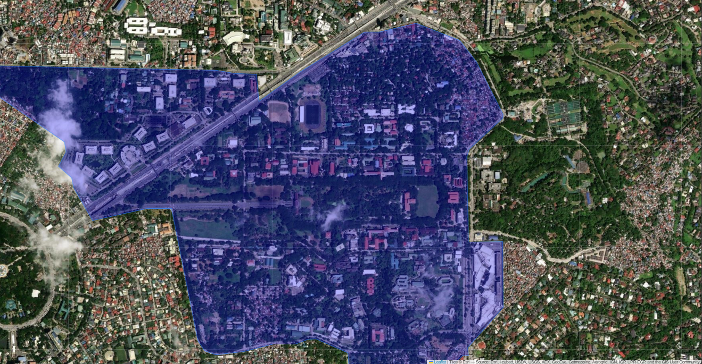
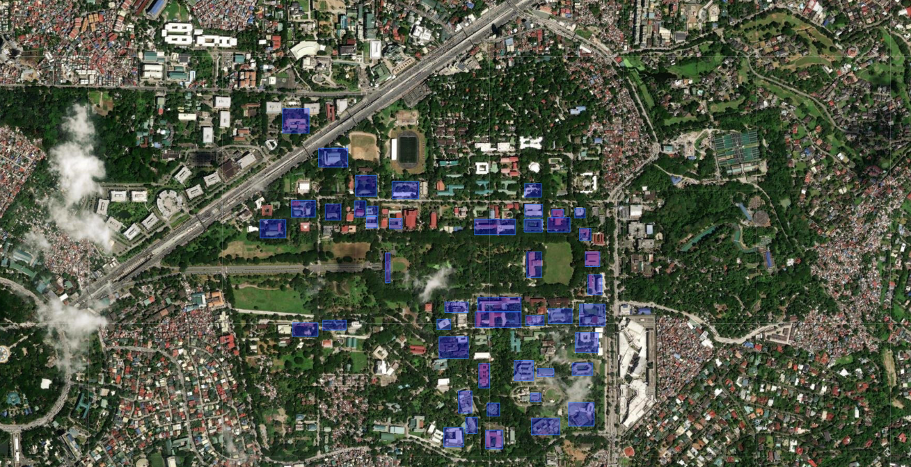

# UP Di-Libot: Your UP Diliman Lakwatsa Checklist

---

## I. Project Description

The [web application](https://ming-suhi.github.io/UP.Di-Libot) maps out a UPD student’s “visiting checklist” by gathering the user’s location history data from Google Maps and marking all locations visited within the bounds of UP Diliman. After inputting the history data, the website displays a masked map of UP Diliman presenting all locations that Google Maps has tracked. Additionally, another layer displays the names of buildings and institutes the user has already visited, thus showing all the landmarks visited and blurring sites that have not been explored.

---

## II. How It Works

The project uses low-resolution satellite imagery provided by [ESRI](https://www.esri.com/en-us/home) as the orthophoto referenced by other integrated data layers, such as:

- The borders of UP Diliman and its neighboring sites  
  
- The polygon representations of relevant infrastructures  
  
- The buffered coordinates forming a conglomerate of circles, showing the sites visited  
  

The web application utilizes several spatial querying techniques to generate a white mask that blurs unexplored areas:

1. **Filter** - The borders of UP are used to select only the points within the borders.
2. **Buffer** - The points are transformed into circle polygons with a set constant buffer radius.
3. **Union** - A single multi-polygon object is created after the points are combined.
4. **Difference** - The combined points are subtracted from the box polygon covering the whole map, revealing the explored areas.

This project was made possible by several open-source projects:

- [Leaflet](https://leafletjs.com/reference.html) is responsible for the interactive map, including map controls (base layer, overlay, zoom).
- [Turf.js](https://turfjs.org/) provided spatial querying functions and the creation of geometries and features of the overlays.

---

## III. Downloading Your Data from Google

1. Go to [Google Takeout](https://takeout.google.com/settings/takeout).
2. Under "Select data to include", select ONLY "Location History (Timeline)".
3. Click "Next Step".
4. Select the following:
   - Transfer to: Send download link via email
   - Frequency: Export once
   - File type: .zip
   - File size: 2GB
5. Press "Create Export".
6. Wait for an email from Google Takeout containing the download link.
7. Download the .zip file(s).
8. Extract the files.
9. If given multiple .zip files, combine the contents of the "Semantic Location History" folders into a single folder.

---

## IV. Using the Web Application

Using the [web application](https://ming-suhi.github.io/UP.Di-Libot) is easy. Simply tick the required checkbox, press the "Generate My Map" button, and select the folder named "Semantic Location History". Note that your data is not uploaded to any server and processing is done by your computer, locally.

---

## V. Considerations

### A. Data Usage

Google Maps requires location access, mobile data usage, and timeline recording permission from the user. The web application relies on recorded coordinates by the application as input to produce the map. If location history is turned off, the user will not be able to see the mapped version of their visited sites.

### B. Temporal Limitations

Since Google Maps tallies coordinates at irregular time intervals due to poor internet connectivity, it may not pinpoint locations that have already been visited. A buffer radius is used to account for time-recording differences.

### C. Spatial Accuracy

Because Google Maps cannot accurately pinpoint the locations already visited by the user, the web application uses a normalized buffer to standardize the grace radius of the coordinates marked by Google Maps, forming a circle union. This creates an expected masked map of visited locations, as long as the map history data of the user has records of the visits.